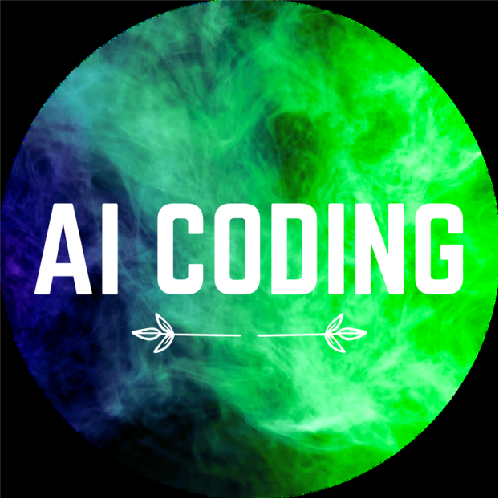
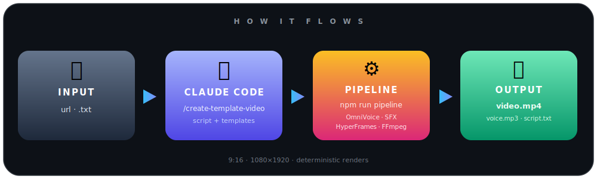
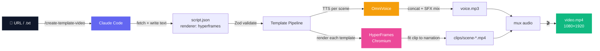

<a id="top"></a>

<div align="center">



<h1>AI&nbsp;Coding&nbsp;·&nbsp;Template&nbsp;Video</h1>

<p><b>A Vietnamese article in. A 9:16 short out.</b><br/>
One command · zero editing · deterministic renders.</p>

<p>


</p>

<p><b>🌐 English</b> · <a href="README.vi.md">Tiếng Việt</a></p>

<sub>
<a href="#-quick-start"><b>Quick Start</b></a> ·
<a href="#-how-it-works"><b>How It Works</b></a> ·
<a href="#-usage"><b>Usage</b></a> ·
<a href="#-templates"><b>Templates</b></a>
</sub>

</div>

---

<div align="center">

</div>

> **The split that makes it reliable:** AI handles _content_ (the script + template choices),
> deterministic code handles _production_ (the pixels). The same `script.json` always renders the
> same video — no surprises, no manual editing.

You supply the **text**. The templates own all the design, layout, and motion. The pipeline does
TTS, sound design, rendering, and the final mux — and hands you three files ready for
CapCut / TikTok / Shorts / Reels:

| File         | What it's for                                  |
| ------------ | ---------------------------------------------- |
| `video.mp4`  | Final 9:16 video with voice + SFX baked in     |
| `voice.mp3`  | Narration track — drop into CapCut             |
| `script.txt` | Plain text — CapCut auto-caption               |

---

<div align="center">

### 📚 Muốn làm chủ Claude Code? Học bài bản cùng AI Coding

<a href="https://www.udemy.com/course/claude-code-in-action-practical-guide-from-beginner-to-pro/?referralCode=C62ACDC291F191DF9E55">

</a>

**Vibe Coding Thực Chiến với Claude Code: Từ Zero đến Hero**
<br/><sub><b>Senior AI Engineer</b> @ AI Coding</sub>

<p><sub>
Setup &nbsp;·&nbsp; Permission Modes &nbsp;·&nbsp; Memory &nbsp;·&nbsp; Hooks &nbsp;·&nbsp; Skills &nbsp;·&nbsp; MCP Servers &nbsp;·&nbsp; Subagents &nbsp;·&nbsp; GitHub<br/>
Từ <b>zero</b> đến <b>hero</b> — đúng cách build agent &amp; tự động hoá như repo này.
</sub></p>

[](https://www.udemy.com/course/claude-code-in-action-practical-guide-from-beginner-to-pro/?referralCode=C62ACDC291F191DF9E55)

</div>

---

## 🚀 Quick Start

```bash
git clone https://github.com/huytranvan2010/AI-auto-generate-video.git
cd AI-auto-generate-video
npm install
# start your local OmniVoice server, then ↓
```

<table>
<tr>
<td valign="top" width="50%">

**With Claude Code** — _recommended_

```text
/create-template-video https://aicodingvn.vercel.app/some-article
```

Claude fetches the article, writes `script.json`, and runs the pipeline for you.

</td>
<td valign="top" width="50%">

**Manual** — _bring your own `script.json`_

```bash
npm run pipeline -- output/my-video/script.json
```

Full control over every scene and template.

</td>
</tr>
</table>

A few minutes later → `output/<slug>/video.mp4` (1080×1920).

---

## 🎥 See it in action

Curious what comes out the other end? The clip below was rendered **end-to-end by the pipeline** —
Vietnamese narration, animated poster templates, and auto-mixed sound effects — all from a single
command, with zero manual editing. This is the raw output, exactly as the tool produces it.

<div align="center">

<video src="./assets/claudecode_aicoding.mp4" controls muted playsinline width="304" height="540"></video>

<sub>▶️ Video not playing inline? <a href="./assets/claudecode_aicoding.mp4">Open the sample video</a></sub>

</div>

---

## 🧠 How It Works



Eight deterministic steps in [`src/render/template-pipeline.ts`](src/render/template-pipeline.ts):

| # | Step             | Output                                                        |
| - | ---------------- | ------------------------------------------------------------ |
| 1 | **Validate**     | `script.json` checked against the Zod schema                 |
| 2 | **Caption text** | `script.txt` — all `voiceText` joined (CapCut auto-caption)  |
| 3 | **TTS / scene**  | `voice/scene-<id>.mp3` via OmniVoice _(idempotent)_          |
| 4 | **Concat voice** | `voice-raw.mp3` with 0.3s gaps + per-scene start times       |
| 5 | **SFX mix**      | `voice.mp3` — sound effects layered onto the narration       |
| 6 | **Render clips** | `clips/scene-<id>-fit.mp4` — template → MP4, fit to narration|
| 7 | **Concat + mux** | `video-silent.mp4` → `video.mp4` (voice muxed in)            |
| 8 | **Done**         | prints result paths + total duration                         |

---

## ⚡ Setup

<details open>
<summary><b>Prerequisites</b></summary>

<br/>

| Item                  | Need       | Notes                                                              |
| --------------------- | ---------- | ------------------------------------------------------------------ |
| **Node.js**           | ≥ 22       | `node --version`                                                  |
| **FFmpeg + ffprobe**  | any modern | must be in PATH (`ffmpeg -version`)                               |
| **Chrome / Chromium** | any        | used by HyperFrames to render each template                      |
| **OmniVoice server**  | running    | local TTS at `OMNIVOICE_ENDPOINT` (default `http://127.0.0.1:8123`) |
| **Claude Code CLI**   | optional   | only for the `/create-template-video` skill                      |

**Install FFmpeg:**

- **Windows** — `winget install Gyan.FFmpeg`
- **macOS** — `brew install ffmpeg`
- **Linux** — `sudo apt install ffmpeg`

</details>

<details open>
<summary><b>Configuration</b> — <code>.env.local</code></summary>

<br/>

OmniVoice is the only TTS provider, and it's local — **no API keys.**

```env
TTS_PROVIDER=omnivoice
OMNIVOICE_ENDPOINT=http://127.0.0.1:8123
```

The server must accept `POST /tts` with `{ text }` and return `audio/mpeg` bytes.

</details>

---

## 🎬 Usage

**Inside Claude Code** _(recommended)_ — pass a URL or a local `.txt`:

```text
/create-template-video https://aicodingvn.vercel.app/iphone-17-200mp
/create-template-video news/my-article.txt
```

The skill reads the content, writes `script.json`, and runs the pipeline. Authoring rules
(template mapping + Vietnamese TTS number handling) live in the
[skill spec](.claude/skills/create-template-video/SKILL.md).

**Or run the pipeline directly** on an existing `script.json`:

```bash
npm run pipeline -- output/<slug>/script.json
```

<details>
<summary><b>📄 <code>script.json</code> shape</b> (template mode)</summary>

<br/>

```json
{
  "version": "1.0",
  "renderer": "hyperframes",
  "aspect": "9:16",
  "metadata": {
    "title": "Apple ra mắt iPhone 17 camera 200MP",
    "source": { "url": "https://...", "domain": "aicodingvn.vercel.app", "image": null },
    "channel": "AI Coding"
  },
  "voice": { "provider": "omnivoice", "speed": 1.0 },
  "scenes": [
    {
      "id": "hook",
      "type": "hook",
      "voiceText": "Apple vừa ra mắt iPhone mười bảy với camera hai trăm megapixel.",
      "templateId": "frame-liquid-bg-hero",
      "inputs": { "kicker": "🔥 Tin nóng", "headline": "iPhone 17", "subheadline": "Camera 200MP", "cta": "Theo dõi ngay", "brand": "AI Coding" }
    },
    {
      "id": "body-1",
      "type": "body",
      "voiceText": "Cảm biến mới thu nhiều ánh sáng hơn, ảnh đêm sắc nét hơn rõ rệt.",
      "templateId": "frame-pentagram-stat",
      "inputs": { "label": "Camera", "headline": "200MP", "subtitle": "Cảm biến lớn nhất từ trước tới nay", "anchor": "200" }
    },
    {
      "id": "outro",
      "type": "outro",
      "voiceText": "Theo dõi AI Coding để xem bản tin công nghệ mới mỗi ngày.",
      "templateId": "frame-logo-outro",
      "inputs": { "brand_name": "AI Coding", "tagline": "Tin công nghệ mỗi ngày", "primary_url": "https://aicodingvn.vercel.app/" }
    }
  ]
}
```

Schema rules: **3–12 scenes** · `scenes[0].type === "hook"` · last scene `type === "outro"` ·
every `templateId` must exist under `templates/`.

</details>

<details>
<summary><b>📁 Output structure</b></summary>

<br/>

```
output/<slug>-<timestamp>/
├── script.json          # input (skill-generated or hand-written)
├── script.txt           # all voiceText joined — CapCut auto-caption
├── voice/
│   ├── scene-hook.mp3    # TTS per scene (idempotent)
│   └── scene-*.mp3
├── voice-raw.mp3        # concatenated voices, no SFX (intermediate)
├── voice.mp3           # final audio with SFX mixed in
├── clips/
│   ├── scene-hook.mp4     # rendered template clip (idempotent)
│   └── scene-hook-fit.mp4 # fitted to the scene's narration length
├── video-silent.mp4    # concatenated clips, no audio (intermediate)
└── video.mp4          # 🎉 final — 1080×1920 + voice + SFX
```

> **Idempotent.** Delete `voice/scene-<id>.mp3` to force re-TTS, or `clips/scene-<id>.mp4` to
> re-render just that scene, then re-run the pipeline.

</details>

---

## 🎨 Templates

Every visual is a self-contained **HyperFrames** project under `templates/` — `index.html` (16:9)
and `compositions/portrait.html` (9:16). You fill the text `inputs`; the template owns the design.
Full slot reference: [`templates/CATALOG.md`](templates/CATALOG.md).

| Template                    | Role  | Best for                                                  |
| --------------------------- | :---: | --------------------------------------------------------- |
| `frame-liquid-bg-hero`      | hook  | Opening hook — aurora hero with headline + CTA pill       |
| `frame-vignelli`            | body  | A single striking stat — dark charcoal + red accent       |
| `frame-pentagram-stat`      | body  | A hero number / benchmark — dark neon + bar chart         |
| `frame-bold-poster`         | body  | A punchy multi-line statement + giant figure              |
| `frame-build-minimal`       | body  | One bold word revealed letter-by-letter — dark/amber      |
| `frame-creative-voltage`    | body  | A creative slogan — electric-blue split + handwriting     |
| `frame-glitch-title`        | body  | Breaking / tech news — cyberpunk RGB-split glitch         |
| `frame-aicoding-list`       | body  | A **list** of 2–5 items (icon + level tag)                |
| `frame-aicoding-comparison` | body  | A **head-to-head** comparison of two things               |
| `frame-logo-outro`          | outro | Default brand end-card — logo glow + name + tagline + URL |
| `frame-statement-outro`     | outro | Alternative outro — red statement card on paper           |

> **Add your own:** drop `templates/<id>/` with `index.html`, `compositions/portrait.html`,
> `hyperframes.json`, `meta.json` (+ `NOTICE.md` if vendored), then add a row to `CATALOG.md`.
> Use a Vietnamese-capable font stack.

---

## 🔊 Sound Effects

SFX live in `assets/sfx/<category>/<name>.mp3`. Per scene, the picker
([`src/assets/sfx-selector.ts`](src/assets/sfx-selector.ts)) resolves in three tiers:

```
1. scene.sfx override   → exact file, or { "name": "none" } to mute
2. semantic match        → voiceText keywords (cảnh báo→alert, kỷ lục→success, ra mắt→reveal …)
3. scene-type default    → hook→hook · body→callout · outro→outro
```

Within a category the file is chosen **deterministically** by hashing the scene id — same script
gives the same SFX, different scenes get different files. The library is large and **not
committed**:

```bash
npm run sfx:download   # fetch the SFX library
npm run sfx:filter     # prune / filter it
```

No `assets/sfx/`? The pipeline just renders without SFX.

---

## 🛠️ Built With

| Layer             | Technology                                                                       |
| ----------------- | -------------------------------------------------------------------------------- |
| **Runtime**       | Node ≥22 · TypeScript 6 · ESM · [tsx](https://github.com/privatenumber/tsx)       |
| **Render**        | [HyperFrames](https://www.npmjs.com/package/hyperframes) `0.6.94` (HTML→MP4 via Chromium) |
| **TTS**           | OmniVoice (local)                                                                |
| **Schema**        | [Zod](https://zod.dev) ^4                                                        |
| **HTTP**          | axios + [nock](https://github.com/nock/nock)                                     |
| **Concurrency**   | [p-limit](https://github.com/sindresorhus/p-limit)                              |
| **A/V**           | FFmpeg + ffprobe                                                                 |
| **Tests**         | [Vitest](https://vitest.dev) ^4                                                  |
| **Orchestration** | [Claude Code](https://docs.claude.com/en/docs/claude-code/overview) skill        |

---

## 🙏 Acknowledgements

- [HyperFrames](https://www.npmjs.com/package/hyperframes) — the HTML-to-video engine behind the templates
- [OmniVoice](https://github.com/k2-fsa/OmniVoice) — local Vietnamese text-to-speech
- [html-video](https://github.com/nexu-io/html-video) — HTML-to-video approach this project builds on
- [Auto-Create-Video](https://github.com/hoquanghai/Auto-Create-Video) — the original project this is based on

---

## 💖 Support this project

If this project saved you time, please consider:

- ⭐ **Star this repo** — it really helps with discoverability
- 🎓 **[Check out AI Coding's courses on Udemy](https://www.udemy.com/user/tran-van-huy-7/)**
- 📱 **Follow AI Coding** on [Facebook](https://www.facebook.com/aicoding2010) · [TikTok](https://www.tiktok.com/@aicoding2010) · [YouTube](https://www.youtube.com/@aicoding2010)
- 💬 Tell a friend who creates content
- 🐛 Report bugs or request features

---

## ⭐ Star History

<div align="center">

<a href="https://star-history.com/#huytranvan2010/AI-auto-generate-video&Date">

</a>

</div>

---

<div align="center">

<br/>

**[⬆ Back to top](#top)**

<sub>Made with ❤️ by <b>AI Coding</b> · <a href="https://aicodingvn.vercel.app/">aicodingvn.vercel.app</a></sub>

</div>
